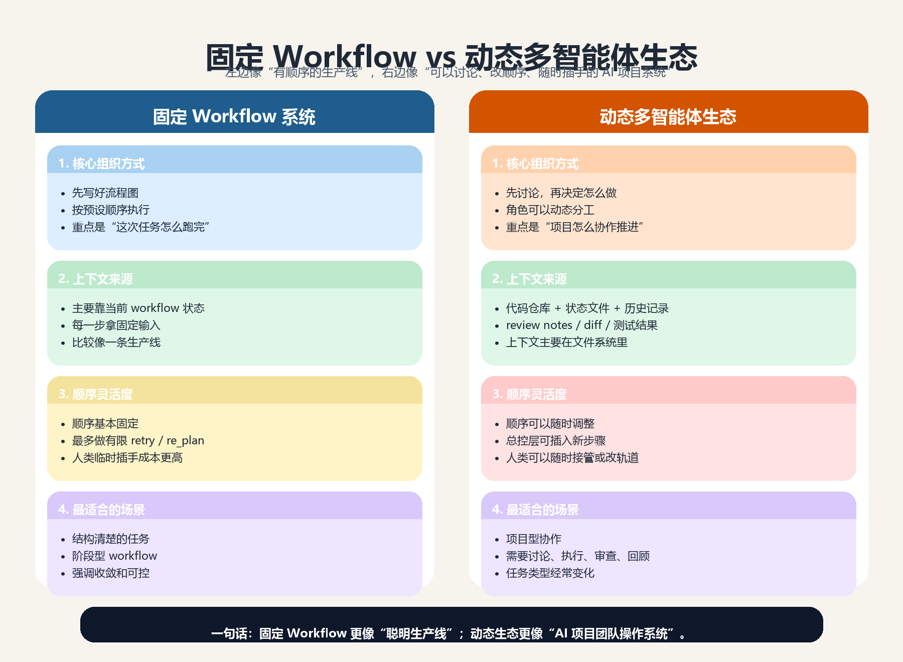
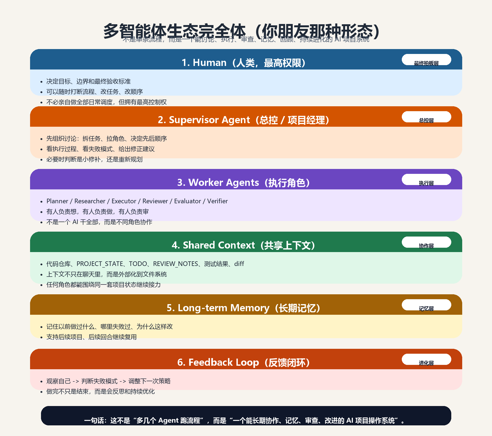

# Adaptive Agent Orchestrator

一个面向可靠性、评估与收敛控制的轻量级多 Agent 编排运行时。

它不是具体业务应用，而是一个 `runtime core（运行时内核）`：

- 让多个 Agent 稳定协作
- 让状态显式共享与裁剪
- 让评估进入运行时闭环
- 让失败可重试、可降级、可解释
- 未来支持 `Human -> Supervisor Agent -> Worker Agents` 的协作层级

---

## 一句话定位

> 一个支持共享状态、运行时评估、收敛控制与诚实降级的轻量多 Agent 编排内核。

---

## 这个项目到底在做什么

这个项目解决的不是“某个具体任务怎么回答”，而是：

- 多个 Agent 如何分工协作
- 状态如何在步骤之间传递
- 什么时候应该继续、重试、失败或降级
- 人类、Supervisor Agent、Worker Agents 之间如何分层协作

可以把它理解成：

- Agent workflow 的运行时内核
- AI 团队协作模式背后的调度与评估系统
- 未来 Agent 生态里的 runtime / control layer

---

## 最终目标形态

这个项目的长期目标不是普通 workflow，而是一个更完整的协作层级：

```text
Human（人类，最高权限）
  ↓
Supervisor Agent（总控 / 监督智能体）
  ↓
Scheduler（调度器）
  ↓
Worker Agents（Planner / Search / Summarizer / Reviewer / Evaluator ...）
  ↓
StateCenter + Evaluator + Memory + Feedback Loop
```

这意味着：

- 人类保留最高权限、风险判断和最终拍板
- Supervisor Agent 未来可以代理大量日常总控动作
- Worker Agents 负责具体执行
- State、Evaluation、Memory、Feedback 进入统一闭环

完整说明见：

- `docs/ecosystem_architecture_v2.md`

---

## 当前一周冲刺范围

当前不是把完整生态一次性做满，而是把这套设计的 `v1 final runtime core` 做成真的可运行系统。

本周必须完成：

- `StateCenter`
- `Scheduler`
- `AgentRegistry`
- `Evaluator(L1)`
- `PlannerAgent`
- `SearchAgent`
- `SummarizerAgent`
- 最简结构化执行日志
- CLI 入口
- 跑通一个 `deep_research` workflow

本周不要求做满：

- 完整 `Supervisor Agent`
- 长期记忆层
- `L2 / L3`
- 完整 checkpoint rollback
- 多模型路由
- Web UI / API
- 并发执行

这不是降低标准，而是明确：

- 长期目标形态不变
- 当前优先把最核心的 runtime 做实

完整说明见：

- `docs/architecture.md`

---

## 核心模块

### `Scheduler`
负责：

- 按 workflow 调度执行
- 控制 retry / fail / 后续扩展 re-plan
- 保证流程收敛

### `StateCenter`
负责：

- 维护共享状态
- 记录中间产物
- 按 Agent 需要裁剪视图

### `Evaluator`
负责：

- 在运行时判断输出质量
- 决定 `continue / retry / fail`
- 后续扩展 `L2 / L3`

### Worker Agents
当前 MVP 先做：

- `PlannerAgent`
- `SearchAgent`
- `SummarizerAgent`

### `Graceful Degradation`
负责：

- 在失败时明确给出边界和降级结果
- 避免系统硬编答案

---

## 为什么这样设计

这套设计的核心取舍是：

- 先静态 workflow 骨架，再有限动态调整
- 先做 `L1` 规则评估，再长 `L2 / L3`
- 先做共享状态，不先做复杂消息总线
- 先做 runtime core，不先做完整生态

这样做的原因是：

- 更容易跑通
- 更容易 debug
- 更容易验证 runtime evaluation 的真实价值
- 更适合从真实应用里长出基础设施，而不是一开始就造宇宙级框架

---

## 和其他两条线的关系

这个项目不是孤立存在的，它和另外两条线直接相关：

### `deep_research_agent`
- 一个真实的 research workflow 应用
- 未来可以作为一个 workflow 运行在这个 orchestrator 上
- 也是 evaluate 资产的重要来源

### future evaluate system
- 从 `deep_research_agent` 中逐步抽离出的评估层
- 提供 judge / taxonomy / compare / regression 经验
- 未来会反哺本项目里的 `Evaluator`

完整说明见：

- `docs/project_relationships.md`

---

## 开发方式路线

当前这个项目仍然以对话框模式开发为主，但开发习惯已经开始向更成熟的多 Agent 协作模式演化。

当前正式路线：

- 对话框模式主力推进
- 同时开始练：
  - 文件化上下文
  - 1 主 1 辅会话分工
  - 任务拆解
  - 角色边界定义

长期目标是：

- 人类保留最高权限
- Supervisor Agent 代理大量日常总控动作
- Worker Agents 围绕共享状态与长期记忆协作

完整说明见：

- `docs/workflow_evolution.md`

---

## 这个项目为什么值得做

这个项目不是“再一个 AI Demo”，而是在做一条更少见的路线：

- `workflow-native agent infrastructure`
- `runtime evaluation`
- `failure handling`
- `graceful degradation`
- `AI-native working style`

它的价值不只在代码本身，还在于：

- 你可以把它讲成一条系统路线
- 它和 `deep_research_agent`、future evaluate system 形成分层关系
- 后面很适合做技术博客、项目展示和面试讲解

市场方向参考见：

- `docs/market_signals_and_skill_focus.md`

---

## 文档导航

### 核心文档
- 当前设计基线：`docs/architecture.md`
- 完整生态蓝图 v2：`docs/ecosystem_architecture_v2.md`
- 下一对话框衔接文档：`docs/next_session_handoff.md`
- 项目关系说明：`docs/project_relationships.md`
- 工作方式演进：`docs/workflow_evolution.md`
- 市场信号与能力积累方向：`docs/market_signals_and_skill_focus.md`
- 1 到 2 年成长路径：`docs/growth_path.md`

### 项目状态
- 当前状态：`PROJECT_STATE.md`
- 历史推进记录：`PROJECT_LOG.md`

### 决策沉淀
- 决策记录索引：`docs/decisions/README.md`
- 决策记录模板：`docs/decisions/000-template.md`

---

## 目录结构

```text
adaptive-agent-orchestrator/
├── docs/
│   ├── decisions/
│   ├── architecture.md
│   ├── ecosystem_architecture_v2.md
│   ├── project_relationships.md
│   ├── workflow_evolution.md
│   ├── growth_path.md
│   └── market_signals_and_skill_focus.md
├── src/
├── tests/
├── workflows/
├── PROJECT_LOG.md
├── PROJECT_STATE.md
├── pyproject.toml
└── README.md
```

---

## 当前状态

当前已经完成：

- 独立新项目建立
- 完整长期目标形态文档
- 当前设计基线文档
- 工作方式路线、项目关系、成长路径、市场方向文档
- 决策记录体系初始化

当前正在进入：

- `v1 final runtime core` 实现阶段

---

## 图示

### 固定 Workflow vs 动态多智能体生态


### 多智能体生态完全体


### 参考与学习
- 从 Claude Code 这类系统值得学习的设计点：`docs/claude_code_learnings.md`

